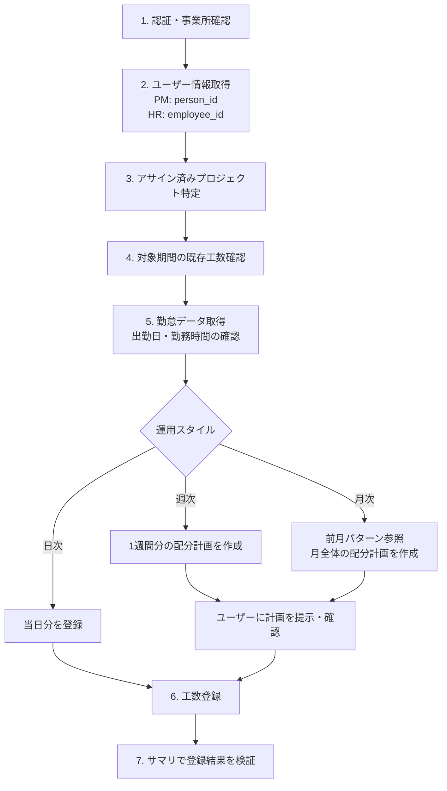

# 工数登録ガイド（勤怠データ連携）

freee人事労務の勤怠データを活用し、freee工数管理に工数を登録するクロスサービスワークフロー。
日次・週次・月次いずれの運用にも対応。

## フロー全体像



## 前提

- PM API: `service: "pm"`、HR API: `service: "hr"` の2サービスを横断して使用
- 工数は登録後に API で修正・削除できない（Web UIのみ）。登録前の確認が重要
- 同じ日・同じプロジェクトに複数回 POST すると加算される（重複チェックなし）

## Step 1: 認証・事業所の確認

```
freee_auth_status
freee_get_current_company
```

認証が無効な場合は `freee_authenticate` で再認証。
事業所が異なる場合は `freee_set_current_company` で切り替え。

## Step 2: ユーザー情報の取得

PM API と HR API で異なるID体系を使用するため、両方から取得する。

### PM側: person_id と company_id

```
freee_api_get
  service: "pm"
  path: "/users/me"
```

- `companies[].id` → PM API の company_id
- `companies[].person_me.id` → 自分の person_id

### HR側: employee_id

```
freee_api_get
  service: "hr"
  path: "/api/v1/users/me"
```

- `companies[].employee_id` → HR API の employee_id

注意: PM の person_id と HR の employee_id は異なる値。混同しないこと。

## Step 3: アサイン済みプロジェクトの特定

### 方法A: マネージャーとして管理するプロジェクト

`manager_ids[]` パラメータで自分の person_id を指定。

```
freee_api_get
  service: "pm"
  path: "/projects"
  query:
    company_id: {company_id}
    manager_ids[]: [{person_id}]
    limit: 100
```

### 方法B: メンバーとしてアサインされたプロジェクト

GET /projects にはメンバーでのフィルタパラメータがない。
全プロジェクトを取得してクライアント側でフィルタする。

```
freee_api_get
  service: "pm"
  path: "/projects"
  query:
    company_id: {company_id}
    operational_status: "in_progress"
    limit: 100
    offset: 0
```

取得後、`projects[].members[].person_id` に自分の person_id が含まれるプロジェクトを抽出する。

注意: レスポンスサイズについて
- GET /projects はプロジェクトあたり数KBのデータを返す（メンバー一覧、タグ、発注先情報を含む）
- プロジェクト数が多い事業所では limit=100 でも数MBに達することがある
- 必ず `operational_status: "in_progress"` で絞り込む
- 全件取得が必要な場合は offset でページネーション（total_count で総数確認）

## Step 4: 対象期間の既存工数確認

```
freee_api_get
  service: "pm"
  path: "/workloads"
  query:
    company_id: {company_id}
    year_month: "YYYY-MM"
```

- `total_count` が 0 でなければ既存データあり
- 既存データがある場合、追加 POST は加算される。重複に注意

## Step 5: 勤怠データの取得

### 方法A: 日ごとの勤怠取得（推奨）

対象日について個別に取得する。日次運用なら当日1件、週次なら5件、月次なら全営業日分。

```
freee_api_get
  service: "hr"
  path: "/api/v1/employees/{employee_id}/work_records/{date}"
  query:
    company_id: {company_id}
```

確認すべきフィールド:

| フィールド | 説明 | 工数登録への影響 |
|-----------|------|----------------|
| day_pattern | "normal_day" / "prescribed_holiday" / "legal_holiday" | 休日はスキップ |
| normal_work_mins | 所定労働時間（分） | 工数配分の合計値 |
| is_absence | 欠勤フラグ | true の場合はスキップ |
| paid_holiday | 有給取得日数（0, 0.5, 1） | 1 の場合はスキップ |
| clock_in_at / clock_out_at | 出退勤時刻 | null の場合は未出勤 |

工数を登録すべき日の条件:
- day_pattern が "normal_day"
- is_absence が false
- clock_in_at が null でない（実際に出勤した日）
- paid_holiday が 1 でない（有給全休でない）

### 方法B: 月次サマリで概要確認

```
freee_api_get
  service: "hr"
  path: "/api/v1/employees/{employee_id}/work_record_summaries/{year}/{month}"
  query:
    company_id: {company_id}
```

注意: work_record_summaries の year/month は給与支払い月を指定する。
翌月払いの企業では実際の勤怠月とずれることがある。
レスポンスの `start_date` と `end_date` で実際の集計期間を確認すること。
日付がずれる場合は方法Aの日次取得を使用する。

## 運用スタイル別ガイド

### 日次運用

毎日その日の工数を登録する。最もリアルタイムで正確。

1. 当日の勤怠を確認（Step 5）
2. normal_work_mins に合わせてプロジェクトごとに POST

```
freee_api_post
  service: "pm"
  path: "/workloads"
  body:
    company_id: {company_id}
    project_id: {project_id}
    date: "YYYY-MM-DD"
    minutes: 480
```

### 週次運用

週末や週明けにまとめて1週間分を登録する。

1. 対象週の勤怠を取得（5営業日分を並列取得可能）
2. 配分計画をテーブル形式で作成

```
| 日付 | プロジェクトA | プロジェクトB | 合計 |
|------|-------------|-------------|------|
| MM/DD (月) | 480分 | - | 480分 |
| MM/DD (火) | 420分 | 60分 | 480分 |
| ...  | ... | ... | ... |
```

3. ユーザーの確認後、1週間分を登録（並列実行可能）

### 月次運用

月末や翌月初にまとめて1ヶ月分を登録する。効率的だが、記憶が曖昧になりやすい。

1. 全営業日の勤怠を取得
2. 前月の工数パターンを参照（任意）

```
freee_api_get
  service: "pm"
  path: "/workloads"
  query:
    company_id: {company_id}
    year_month: "YYYY-MM"    # 前月を指定
```

3. 前月パターンを基にデフォルト配分を提案し、差分のみユーザーに確認
4. 週単位で分割して登録（エラー時の影響を限定するため）
5. 各週の登録後にサマリで中間確認

## Step 6: 工数の登録

```
freee_api_post
  service: "pm"
  path: "/workloads"
  body:
    company_id: {company_id}
    project_id: {project_id}
    date: "YYYY-MM-DD"
    minutes: 480
    memo: "作業内容"           # 任意、最大255文字
```

- 複数の POST を並列実行しても問題ない
- 1日に複数プロジェクトがある場合はプロジェクトごとに POST する
- person_id を省略するとログインユーザーに登録される
- プロジェクトに工数タグが必須設定されている場合は workload_tags が必要

工数タグ付きの登録:

```
freee_api_post
  service: "pm"
  path: "/workloads"
  body:
    company_id: {company_id}
    project_id: {project_id}
    date: "YYYY-MM-DD"
    minutes: 60
    workload_tags:
      - tag_group_id: {tag_group_id}
        tag_id: {tag_id}
```

### 登録時の注意事項

- minutes は1以上の整数（分単位）
- 同日・同プロジェクトへの複数 POST は加算（重複チェックなし）
- 再実行前に必ず GET /workloads で現在の登録状況を確認
- 週次・月次でまとめて登録する場合は、週単位で登録 → 確認を繰り返す

## Step 7: 登録結果の検証

```
freee_api_get
  service: "pm"
  path: "/workload_summaries"
  query:
    company_id: {company_id}
    year_month: "YYYY-MM"
```

`minutes` が勤怠の合計勤務時間と一致することを確認する。

Web UI での確認: https://pm.freee.co.jp

## Tips

- 祝日判定: day_pattern が "prescribed_holiday" の日は祝日や所定休日
- 半休の日: paid_holiday が 0.5 の場合、normal_work_mins が半日分になる。工数もそれに合わせる
- 並列 POST: 複数の POST /workloads を同時に実行しても問題ない
- minutes の単位: 1時間=60分、半日=240分、1日=480分（一般的な所定労働時間の場合）
- 前月コピー: 毎月ほぼ同じ配分の場合、前月データを取得してテンプレートにすると効率的
- 月次でまとめる場合: 週ごとに登録 → 確認を繰り返すことで誤りに早く気づける

## エラー対応

| 状況 | 対処 |
|------|------|
| POST /workloads で 400 | project_id, date, minutes を確認。minutes は1以上の整数 |
| 重複登録してしまった | Web UI (https://pm.freee.co.jp) で修正・削除 |
| 勤怠データが取得できない | employee_id を確認。HR API の /api/v1/users/me で再取得 |
| work_record_summaries の月がずれる | 給与支払い月のオフセットを確認。日次取得に切り替える |
| GET /teams や GET /people で 401 | システム管理者ロールが必要。プロジェクトマネージャーではアクセス不可 |
| GET /projects のレスポンスが巨大 | operational_status で絞り込み、offset でページネーション |

## 関連レシピ・リファレンス

- `recipes/pm-operations.md` - PM API 全般の操作ガイド
- `recipes/hr-attendance-operations.md` - 勤怠操作ガイド
- `references/pm-workloads.md` - 工数 API 詳細リファレンス
- `references/pm-projects.md` - プロジェクト API 詳細リファレンス
- `references/hr-attendances.md` - 勤怠 API 詳細リファレンス
