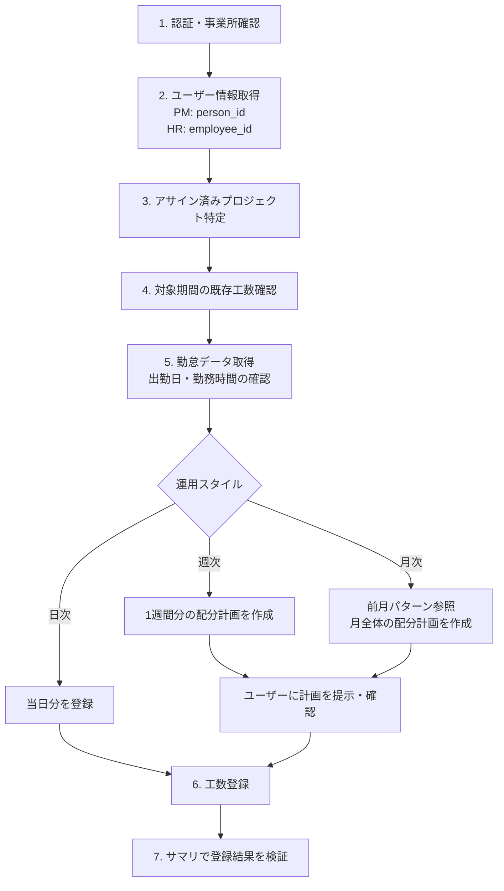

# 工数登録ガイド（勤怠データ連携）

freee人事労務の勤怠データを活用し、freee工数管理に工数を登録するクロスサービスワークフロー。
日次・週次・月次いずれの運用にも対応。

## フロー全体像



## 概要

- PM API: `service: "pm"`、HR API: `service: "hr"` の2サービスを横断して使用
- 工数は登録後に API で修正・削除できない（Web UIのみ）。登録前の確認が重要
- 同じ日・同じプロジェクトに複数回 POST すると加算される（重複チェックなし）

## 利用可能なパス

| パス | サービス | 説明 |
|------|---------|------|
| `/users/me` | pm | ログインユーザー（company_id・person_id 取得） |
| `/projects` | pm | プロジェクト一覧 |
| `/workloads` | pm | 工数登録・一覧 |
| `/workload_summaries` | pm | 工数サマリ |
| `/api/v1/users/me` | hr | ログインユーザー（employee_id 取得） |
| `/api/v1/employees/{id}/work_records/{date}` | hr | 勤怠記録（日次） |
| `/api/v1/employees/{id}/work_record_summaries/{year}/{month}` | hr | 勤怠サマリ（月次） |

## 使用例

### Step 1: 認証・事業所の確認

```
freee_auth_status
freee_get_current_company
```

認証が無効な場合は `freee_authenticate` で再認証。
事業所が異なる場合は `freee_set_current_company` で切り替え。

### Step 2: ユーザー情報の取得

PM API と HR API で異なるID体系を使用するため、両方から取得する。

PM側（person_id と company_id）:

```
freee_api_get {
  "service": "pm",
  "path": "/users/me"
}
```

- `companies[].id` → PM API の company_id
- `companies[].person_me.id` → 自分の person_id

HR側（employee_id）:

```
freee_api_get {
  "service": "hr",
  "path": "/api/v1/users/me"
}
```

- `companies[].employee_id` → HR API の employee_id

### Step 3: アサイン済みプロジェクトの特定

マネージャーとして管理するプロジェクト（`manager_ids[]` で絞り込み可能）:

```
freee_api_get {
  "service": "pm",
  "path": "/projects",
  "query": {
    "company_id": 12345,
    "manager_ids[]": [10],
    "limit": 100
  }
}
```

メンバーとしてアサインされたプロジェクト（クライアント側でフィルタ）:

```
freee_api_get {
  "service": "pm",
  "path": "/projects",
  "query": {
    "company_id": 12345,
    "operational_status": "in_progress",
    "limit": 100,
    "offset": 0
  }
}
```

取得後、`projects[].members[].person_id` に自分の person_id が含まれるプロジェクトを抽出する。

### Step 4: 対象期間の既存工数確認

```
freee_api_get {
  "service": "pm",
  "path": "/workloads",
  "query": {
    "company_id": 12345,
    "year_month": "2026-03"
  }
}
```

`total_count` が 0 でなければ既存データあり。追加 POST は加算されるため重複に注意。

### Step 5: 勤怠データの取得

日ごとの勤怠取得（推奨）:

```
freee_api_get {
  "service": "hr",
  "path": "/api/v1/employees/{employee_id}/work_records/2026-03-03",
  "query": {
    "company_id": 12345
  }
}
```

確認すべきフィールド:

| フィールド | 説明 | 工数登録への影響 |
|-----------|------|----------------|
| day_pattern | "normal_day" / "prescribed_holiday" / "legal_holiday" | 休日はスキップ |
| normal_work_mins | 所定労働時間（分） | 工数配分の合計値 |
| is_absence | 欠勤フラグ | true の場合はスキップ |
| paid_holiday | 有給取得日数（0, 0.5, 1） | 1 の場合はスキップ |
| clock_in_at / clock_out_at | 出退勤時刻 | null の場合は未出勤 |

月次サマリでの概要確認（補助的に使用）:

```
freee_api_get {
  "service": "hr",
  "path": "/api/v1/employees/{employee_id}/work_record_summaries/2026/3",
  "query": {
    "company_id": 12345
  }
}
```

### Step 6: 工数の登録

```
freee_api_post {
  "service": "pm",
  "path": "/workloads",
  "body": {
    "company_id": 12345,
    "project_id": 601,
    "date": "2026-03-03",
    "minutes": 480,
    "memo": "作業内容"
  }
}
```

工数タグ付きの登録:

```
freee_api_post {
  "service": "pm",
  "path": "/workloads",
  "body": {
    "company_id": 12345,
    "project_id": 601,
    "date": "2026-03-03",
    "minutes": 60,
    "workload_tags": [
      { "tag_group_id": 11, "tag_id": 12 }
    ]
  }
}
```

プロジェクトに工数タグが必須設定されている場合は `workload_tags` が必要。

### Step 7: 登録結果の検証

```
freee_api_get {
  "service": "pm",
  "path": "/workload_summaries",
  "query": {
    "company_id": 12345,
    "year_month": "2026-03"
  }
}
```

`minutes` が勤怠の合計勤務時間と一致することを確認する。

Web UI での確認: https://pm.freee.co.jp

## Tips

- PM の person_id と HR の employee_id は異なる値。混同しないこと
- minutes の単位: 1時間=60分、半日=240分、1日=480分（一般的な所定労働時間の場合）
- 祝日判定: day_pattern が "prescribed_holiday" の日は祝日や所定休日
- 半休の日: paid_holiday が 0.5 の場合、normal_work_mins が半日分になる。工数もそれに合わせる
- 並列 POST: 複数の POST /workloads を同時に実行しても問題ない
- 前月コピー: 毎月ほぼ同じ配分の場合、前月データを取得してテンプレートにすると効率的
- 再実行前に必ず GET /workloads で現在の登録状況を確認する

### 運用スタイル別ガイド

日次運用（毎日その日の工数を登録）:
1. 当日の勤怠を確認（Step 5）
2. normal_work_mins に合わせてプロジェクトごとに POST

週次運用（週末や週明けにまとめて1週間分を登録）:
1. 対象週の勤怠を取得（5営業日分を並列取得可能）
2. 配分計画をテーブル形式で作成してユーザーに確認

```
| 日付 | プロジェクトA | プロジェクトB | 合計 |
|------|-------------|-------------|------|
| MM/DD (月) | 480分 | - | 480分 |
| MM/DD (火) | 420分 | 60分 | 480分 |
| ...  | ... | ... | ... |
```

3. 確認後、1週間分を一括登録（並列実行可能）

月次運用（月末や翌月初にまとめて1ヶ月分を登録）:
1. 全営業日の勤怠を取得
2. 前月の工数パターンを参照し、デフォルト配分を提案。差分のみユーザーに確認
3. 週単位で分割して登録 → 各週の登録後にサマリで中間確認

## 注意点

- work_record_summaries の year/month は給与支払い月を指定する。翌月払いの企業では実際の勤怠月とずれることがある。レスポンスの `start_date` と `end_date` で実際の集計期間を確認すること。日付がずれる場合は日次取得を使用する
- GET /projects はプロジェクトあたり数KBのデータを返す（メンバー一覧、タグ、発注先情報を含む）。プロジェクト数が多い事業所では limit=100 でも数MBに達するため、必ず `operational_status: "in_progress"` で絞り込む
- 重複登録してしまった場合は Web UI（https://pm.freee.co.jp）で修正・削除する
- POST /workloads で 400 が返る場合: project_id, date, minutes を確認。minutes は1以上の整数
- GET /projects のレスポンスが巨大な場合: operational_status で絞り込み、offset でページネーション

## リファレンス

- `recipes/pm-operations.md` - PM API 全般の操作ガイド
- `recipes/hr-attendance-operations.md` - 勤怠操作ガイド
- `references/pm-workloads.md` - 工数 API 詳細
- `references/pm-projects.md` - プロジェクト API 詳細
- `references/hr-attendances.md` - 勤怠 API 詳細
